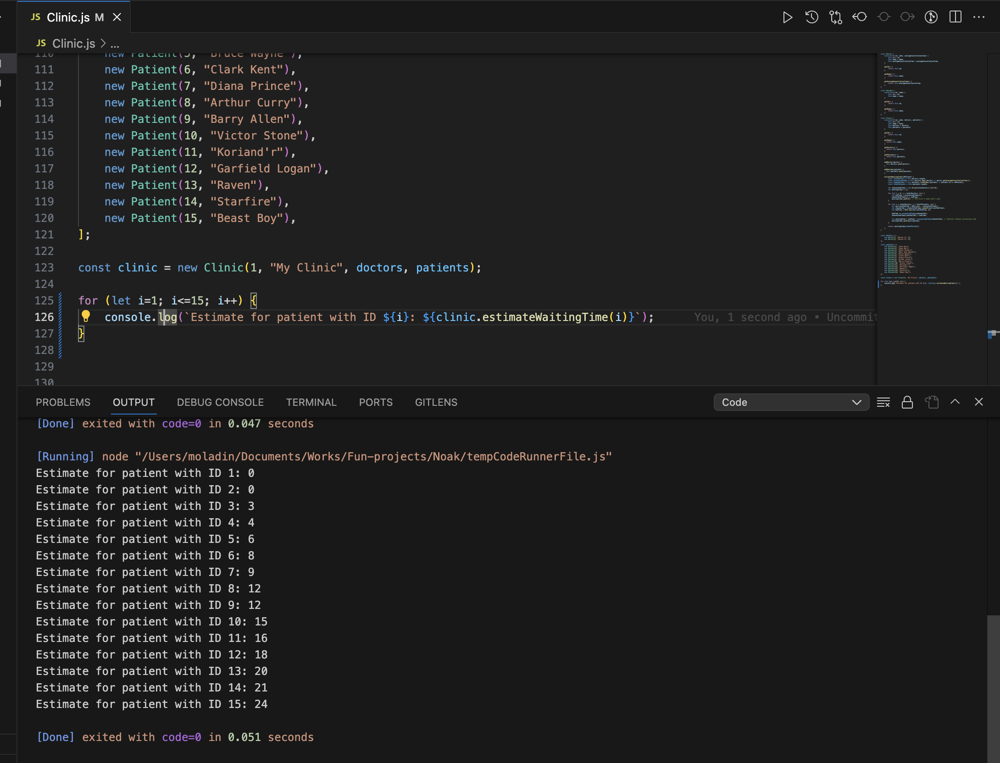

# Noak Clinic

Write an algorithm in JavaScript to calculate patient’s estimated waiting time. The algorithm should work for different amount of doctors and patient queue positions – it should accept an array of Doctor objects and patient’s position in queue as inputs and return the patient’s waiting time as output. Your codes should also include the implementation for the Doctor class. For simplicity, assume all the patients in the queue have no preference for the doctors they want to consult and all the doctors are available and not seeing any patient initially.

## Result

